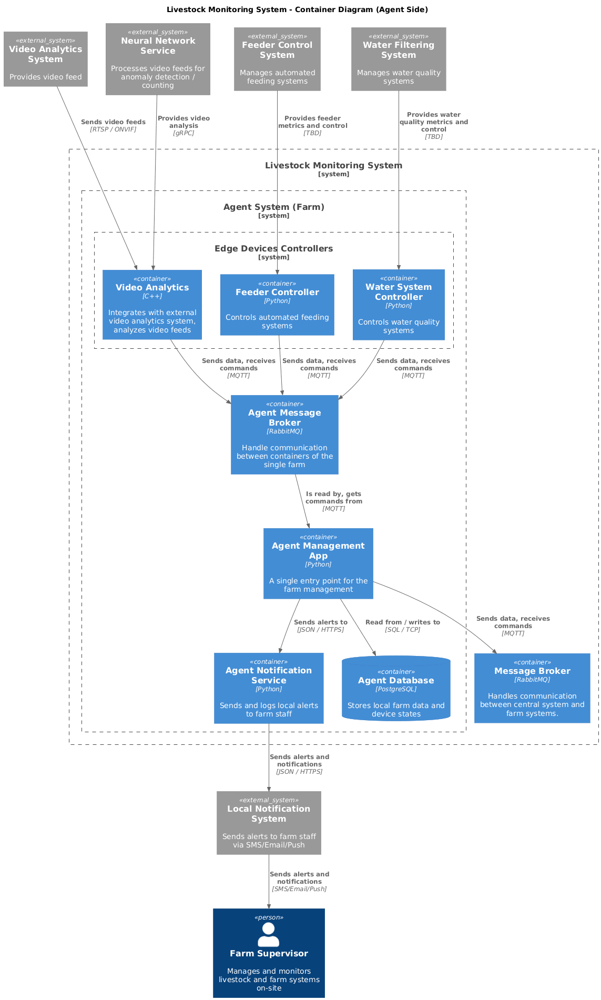

### **Документ:** ADR_02

### **Название задачи:** Разработка высокоуровневого видения на уровне С2 (контейнерной диаграммы) для платформы мониторинга поголовья скота.

### **Автор:** Егоров Антон
### **Дата:** 01.11.2025

### **Проблема**

См. [ADR_01](./../Task1/adr_01.md)

### **Функциональные требования**

См. [ADR_01](./../Task1/adr_01.md)

### **Нефункциональные требования**

См. [ADR_01](./../Task1/adr_01.md)

### **Решение**

Для удобства чтения контейнерной диаграммы, она была разделена на две части:
- **Центральная система** - отвечает за сбор данных от отдельных ферм, предоставляет доступ к управлению фермами.
- **Система агента** (отдельной фермы) - отвечает за работу отдельной фермы, собирает данные с датчиков, нотифицирует дежурный персонал, способна к автономной работе в случае отсутствия интернета.

#### **Контейнерная диаграмма центральной системы**

#### **Контейнерная диаграмма системы агента**

- На уровне C1 (_контекст системы_) участвуют 3 основных актора:
  - **Дежурный персонал фермы** (_Farm Supervisor_) — отвечает за мониторинг состояния животных и систем на ферме, получает оповещения о нештатных ситуациях, имеет доступ в масштабе одной фермы.
  - **Менеджер ферм** (_Farm Operations Manager_) — отвечает за управление несколькими фермами, получает агрегированные данные и отчёты, имеет доступ в масштабе всей системы.
  - **Бизнес-аналитик** (_Business Analyst_) — отвечает за анализ метрик и данных, использует BI-инструменты для создания отчётов и визуализаций.
- Дежурный персонал фермы (_Farm Supervisor_) абстрагирован единым актором. В реальности, это могут быть разные группы людей, ответственные за различные аспекты мониторинга и управления фермой. Система должна поддерживать возможность настройки ролей, доступов и адресации оповещений для разных пользователей.
- Система оперативного оповещения дежурного персонала (_Local Notification Service_) на ферме вынесена в отдельный "внешний" компонент, так как её реализация может сильно варьироваться в зависимости от конкретной фермы и её инфраструктуры. Разрабатываемая система должна иметь возможность интеграции с разными системами оповещения, будь то SMS, email, мессенджеры или специализированные приложения.

### **Альтернативы**

- Использование единой централизованной системы оповещений для всех ферм. Однако это решение не учитывает возможные проблемы с интернет-соединением на отдельных фермах, что может привести к задержкам в получении критически важных оповещений.

**Недостатки, ограничения, риски**

- На ферме должна быть готовая инфраструктура для оповещений, даже в случае отсутствия интернета.
