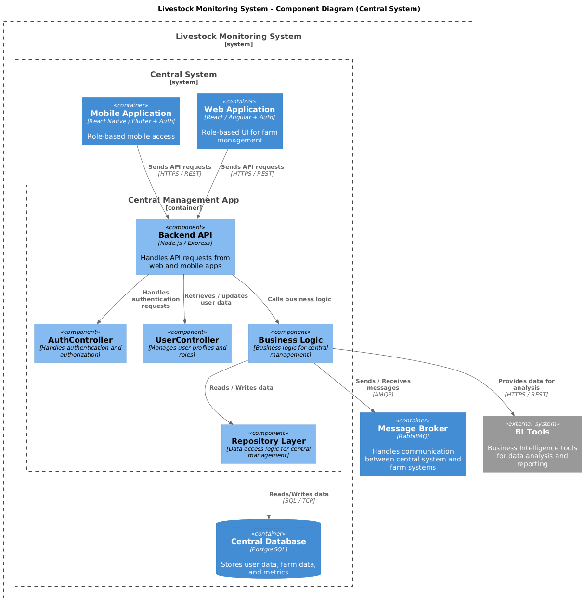
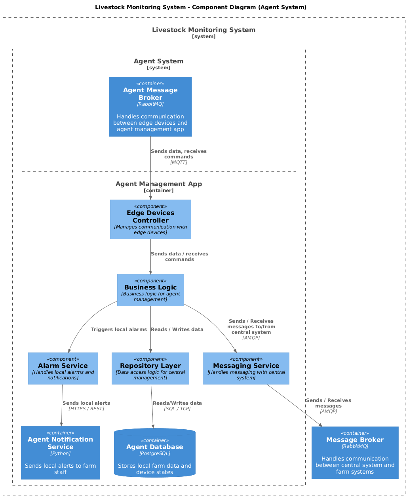
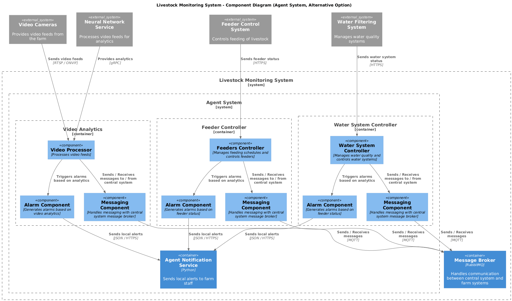

### **Документ:** ADR_03

### **Название задачи:** Разработка С3 (диаграммы компонент) и С4 (диаграммы кода) для платформы мониторинга поголовья скота.

### **Автор:** Егоров Антон
### **Дата:** 03.11.2025

### **Проблема**

См. [ADR_01](./../Task1/adr_01.md)
Решение на уровне С2 представлено в [ADR_02](./../Task2/adr_02.md)

### **Функциональные требования**

См. [ADR_01](./../Task1/adr_01.md)

### **Нефункциональные требования**

См. [ADR_01](./../Task1/adr_01.md)

### **Решение**

Для упрощения, ниже приведены компонентные диаграммы только для наиболее важных элементов системы: центральной системы и системы агента на ферме (основное и альтернативное решения).

#### **Компонентная диаграмма центральной системы**

#### **Компонентная диаграмма системы агента**

- TBD

### **Альтернативы**

- Можно упростить архитектуру агента, убрав брокер сообщений и управляющий контейнер - в таком случае все компоненты будут напрямую взаимодействовать с сервисом оповещений и отсылать данные в центральную систему. Однако это усложнит масштабирование и интеграцию новых компонентов в будущем, добавляя дублирование логики взаимодействия в каждом компоненте. Ниже представлена альтернативная диаграмма контейнеров для системы агента без брокера сообщений и управляющего контейнера:

**Недостатки, ограничения, риски**

- На ферме должна быть готовая инфраструктура для оповещений, даже в случае отсутствия интернета.
